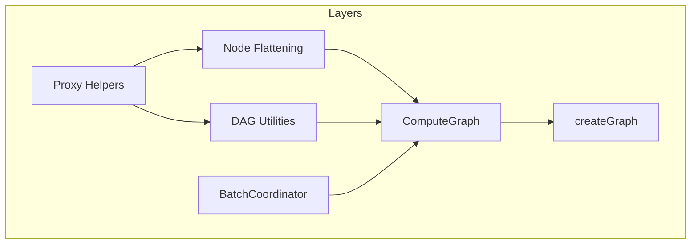

# Architecture

**data-compute** is a TypeScript-first computation graph engine that keeps derived state consistent across sync and async updates. It separates computation from reactivity: the graph never owns state; it takes a granular patch, merges with `getState()` if provided, runs declarative formulas and data sources in topological order, batches async requests, and returns a granular patch (inputs + computed fields that changed).

For usage, API reference, and integration patterns, see [README.md](README.md).

## Architecture Overview

| Layer | Responsibility |
|-------|-----------------|
| Proxy helpers | `trackingProxy` wraps real data; `dryRunProxy` runs formulas without data — both record accessed paths into a `Set<string>`. |
| Node Flattening | Flattens deeply nested configuration objects (`formulas`, `dataSources`) into a flat array of nodes with template paths (e.g. `items.*.tax`). |
| DAG utilities | `topoSort` (Kahn's algorithm) produces execution order; `normalizePath` maps array accesses to templates. |
| BatchCoordinator | Collects `batchRequest` payloads within a microtask, deduplicates via optional `dedupeKey`, flushes one batched query per channel. |
| ComputeGraph | The main class. Construction = static analysis (dry-run + topo sort). `compute(patch)` accepts `DeepPartial<Root>`; multiple calls in the same microtask coalesce via `pendingPatches` + `Promise.resolve().then(flushCompute)`. `flushCompute` coalesces patches, fetches base via `getState?.()`, builds full state with `deepMerge`, executes DAG, calls `setState?.(granularPatch)` on success. Returns `Promise<DeepPartial<Root>>`. |
| createGraph | The public factory with two overloads (direct call or builder pattern). |

---

## Layer-by-Layer Breakdown

### Proxy Helpers

**File:** [src/tracking/proxy.ts](src/tracking/proxy.ts)

- **`trackingProxy(target, deps)`** — Wraps real runtime data in a recursive Proxy. Every property access is recorded into `deps` as dotted paths (e.g. `pricing.taxRate`). Used by `trace()` and for runtime dependency tracking.
- **`dryRunProxy(deps)`** — Phantom proxy for the static dependency extraction pass. No real data is needed; returns safe defaults (`0`, `""`, `true`, empty iterator) so formula bodies can execute without throwing. Records all accessed paths. Async formulas throw when awaited, but synchronous accesses before that point are captured.
- **Short-circuit array methods** — `find`, `findIndex`, `findLast`, `findLastIndex`, `some`, `every` are wrapped to call `touchArrayElements` first (records every element), then re-run the native method on a proxied copy. Ensures accurate dependency tracking even when the native method would stop early.

### Node Flattening

**File:** [src/graph/flatten.ts](src/graph/flatten.ts)

- Converts the deep `DeepFormulaMap` and `DataSourceMap` definitions into a flat array of nodes (`FlatNode[]`).
- Recognizes `each()` and `eachDataSource()` markers, converting them into wildcard template paths (e.g., `items.*.tax`).

### DAG Utilities

**File:** [src/dag/index.ts](src/dag/index.ts)

- **`topoSort(nodes, adj)`** — Kahn's algorithm. `adj` maps each node to the set of nodes it depends on. Returns `{ order, hasCycle }`; `order` is execution order (dependencies before dependents).
- **`normalizePath(path)`** — Converts explicit array indices into templates (`items.0.price` -> `items.*.price`).
- **`pathDependencies(accessed, self)`** — Adds implicit dependencies on parent objects. If `a.b.c` is accessed, it implicitly ensures `a` and `a.b` are constructed first.

### BatchCoordinator

**File:** [src/batch/coordinator.ts](src/batch/coordinator.ts)

- Collects async request payloads within a microtask via `queueMicrotask`.
- Deduplicates via optional `dedupeKey` on the `batchRequest` config — identical keys within a batch collapse to one request.
- Manages `AbortController` cancellation for stale protection.

### ComputeGraph

**File:** [src/graph/compute-graph.ts](src/graph/compute-graph.ts)

- **Construction** — Static analysis: maps flattened nodes, runs them with `dryRunProxy` to build `depsMap` and `reverseMap`, runs `topoSort`. Cyclic graphs throw (or freeze per `cyclic` option).
- **`compute(patch)`** — Increment version, push patch to `pendingPatches`, schedule `flushCompute` in microtask (or reuse existing promise). In `flushCompute`: coalesce all patches with `deepMerge`, get base from `getState?.() ?? granularPatch`, build state = `deepMerge(JSON.parse(JSON.stringify(base)), granularPatch)`, execute formulas in topo order, write results into `granularPatch` via `setByPath`, call `setState?.(granularPatch)` if not stale, return granular patch.
- **`getState`** — Called at flush time to get latest full state; prevents stale closures when inputs change between `compute()` and microtask.
- **`setState`** — Called when compute completes (non-stale); receives granular patch; use `Object.assign(state, patch)` to merge.
- **`trace(input)`** — Reuses `trackingProxy` for synchronous-only execution trace; async formulas capture up to the first await.

### createGraph

**File:** [src/graph/index.ts](src/graph/index.ts)

- Two overloads: `createGraph(formulas, dataSources?, options?)` (direct) or `createGraph()(formulas, dataSources?, options?)` (builder pattern).

---

## Key Design Choices

| Choice | Implementation |
|--------|-----------------|
| Granular input/output | `compute(patch)` accepts `DeepPartial<Root>`. Returns granular patch. `setState` receives same. `Object.assign(state, patch)` merges. |
| Microtask batching | Multiple `compute()` calls before flush coalesce via `pendingPatches.reduce(deepMerge)`. One DAG execution per microtask. |
| getState / setState | `getState` called at flush to avoid stale closures. `setState` called on success with granular patch. |
| Declarative Nodes | Pure math goes in arg 1, async fetching goes in arg 2. `batchRequest` and `request` factory functions define the node logic. |
| Nested Graphs | Formulas strictly mirror the structural shape of `Root`, allowing nested definitions and deep dependency tracking. |
| Dependency extraction | Once at construction. Each formula is called with `dryRunProxy` for static tracking. |
| Async data sources | Async queries are pushed out of the formula body and encapsulated in declarative `DataSourceNodes`. |
| Snapshot semantics | Formulas receive `Object.freeze({...state})`. Even if it holds a reference across an array iteration, it cannot see mutations from later formulas. |
| Stale protection | Monotonic `version` counter increments on each `compute()` call. After every await, version is checked. If stale: `"discard"` marks remaining nodes stale and returns; `"discard-and-retry"` recurses with the same input. |
| Short-circuit arrays | `touchArrayElements` touches all elements first, then re-run on proxied copy. Ensures all element accesses are tracked. |

---

## Data Flow

```mermaid
flowchart LR
    Patch[Granular Patch] --> Compute[compute]
    Compute --> PushPatch[Push to pendingPatches]
    PushPatch --> Microtask[Microtask: flushCompute]
    Microtask --> Coalesce[Coalesce patches via deepMerge]
    Coalesce --> GetBase[getState or use patch as base]
    GetBase --> Merge[deepMerge base + patch = state]
    Merge --> Loop[For each node in topo order]
    Loop --> IsEach{Is each?}
    IsEach -->|Yes| ArrayMap[Map array elements]
    IsEach -->|No| NodeExec[Execute Node]
    ArrayMap --> NodeExec
    NodeExec --> BatchType{Type?}
    BatchType -->|Formula| RunFunc[Sync Formula]
    BatchType -->|Batch| Coordinator[BatchCoordinator]
    BatchType -->|Request| SingleReq[Async Request]
    RunFunc --> StoreResult[setByPath state + granularPatch]
    Coordinator --> Await
    SingleReq --> Await
    Await --> StaleCheck{Stale?}
    StaleCheck -->|Yes| Abort[Abort / Retry]
    StaleCheck -->|No| StoreResult
    StoreResult --> Loop
    Loop --> SetState[setState granularPatch]
    SetState --> Output[Return granular patch]
```

---

## File Map

| File | Responsibility |
|------|-----------------|
| [src/index.ts](src/index.ts) | Public exports and type re-exports |
| [src/graph/index.ts](src/graph/index.ts) | `createGraph` factory |
| [src/graph/compute-graph.ts](src/graph/compute-graph.ts) | `ComputeGraph` class — construction, `compute()`, `trace()`, introspection |
| [src/graph/flatten.ts](src/graph/flatten.ts) | Deep tree to flat array conversion |
| [src/graph/deps-maps.ts](src/graph/deps-maps.ts) | Dry-run builder for dependency/reverse mapping |
| [src/tracking/proxy.ts](src/tracking/proxy.ts) | `trackingProxy`, `dryRunProxy`, `isProxy`, short-circuit array handling |
| [src/tracking/accessor.ts](src/tracking/accessor.ts) | `resolveAccessor` — resolves `(x) => x.total` to `"total"` via dry-run |
| [src/dag/index.ts](src/dag/index.ts) | `topoSort`, `pathDependencies`, `normalizePath` |
| [src/batch/coordinator.ts](src/batch/coordinator.ts) | `BatchCoordinator` — microtask coalescing, deduplication, flush |
| [src/types.ts](src/types.ts) | All shared types — `DeepFormulaMap`, `DataSourceMap`, `Graph`, etc. |
